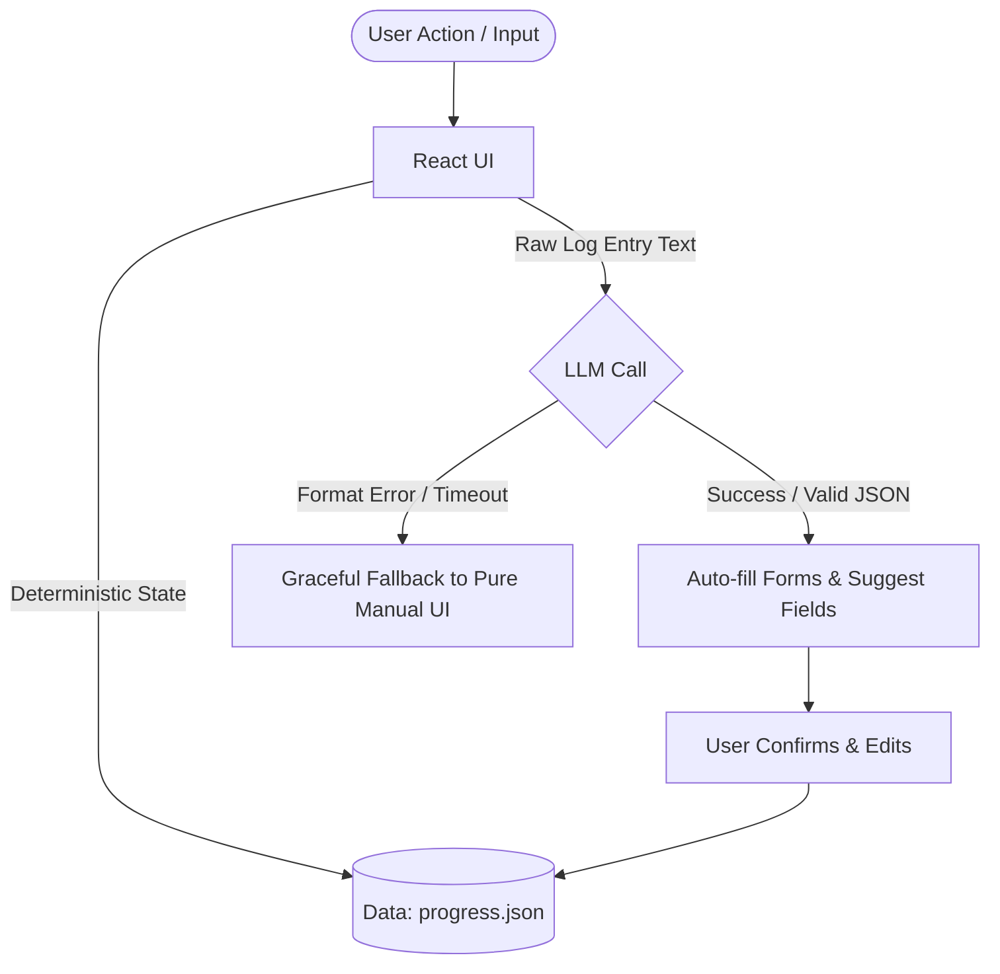

# Goal OS: Low-Cost / Free-Tier LLM Intelligence Integration

This document outlines how we can take the **Goal OS — Self-Planner & Execution Tracker** concepts in [PLANNER_IDEAS.md](file:///Users/starboundcoder/Dev/Goal/PLANNER_IDEAS.md) and supercharge them using **local models (5B–8B parameter size like Llama-3-8B / Qwen-2.5-7B)** or **free-tier API models (like Gemini 2.0 Flash / Qwen-72B via OpenRouter)** without sacrificing speed, reliability, or budget.

---

## The Core Philosophy: "Defense in Depth"

Small models (5B–8B parameter scale) and free endpoints have a few common failure modes:
1. **Formatting Unreliability**: They struggle to output syntactically valid JSON every single time, leading to `JSON.parse` crashes.
2. **Hallucinations**: They make up nonexistent topics or dates if given vague instructions.
3. **Latency & Timeouts**: Free-tier APIs and local models running on CPU/GPU can occasionally stall or hit rate limits.

To prevent these models from breaking the web application, we apply a **Hybrid Architecture**:



### The Three Safety Pillars:
* **The LLM is a Suggestion Engine, Not the State Manager**: The LLM *never* writes directly to your database or updates progress.json without a user-facing review card. You are the ultimate gatekeeper.
* **Deterministic Fallbacks**: If the LLM takes more than 1.5 seconds, is offline, or outputs garbage, the app falls back to standard manual drop-downs and input fields.
* **Aggressive Input Slicing (Context Minimization)**: Instead of passing your entire 600-line blueprint, the system slices only the relevant cluster or sub-array before sending it to the model.

---

## 3 Premium, Low-Friction LLM Features

We can add these three features to the `PLANNER_IDEAS.md` spec to inject meaningful intelligence into your grind.

### 1. The Zero-Friction "Semantic Logger" (Auto-Tagger)
* **How it works**: Instead of clicking three dropdowns to log study time, you type a raw, informal sentence in a terminal-like input.
* **Example Input**: `"fiddled with my Triton block-level matrix multiply kernel today for about 2 hours, benchmarked it against PyTorch and got 95% of peak cublas perf"`
* **LLM Action**: Parses the text, maps it to the exact blueprint cluster/topic, estimates duration, and rates your momentum.
* **UI Presentation**: Populates a preview card:
  ```
  [ Confirm Log Entry ] 
  • Duration: 2.0 hrs  • Cluster: α — Frontier AI
  • Topic: Low-level GPU programming (Triton)
  • Status: Done ✓ (Benchmark artifact ready)
  ```

### 2. The Systems Coach (Weekly Synthesis & Nudges)
* **How it works**: Standard trackers show boring bar charts. The Systems Coach reads your logs for the week and your blueprint requirements, then generates a dense, high-signal, terminal-style diagnosis of your pacing.
* **Example Output**:
  ```
  >>> GOAL OS SYSTEMS COACH REPORT:
  * Momentum: Strong in Cluster α (3 logs, CUDA/Triton optimization).
  * Architecture Alert: You are doing deep GPU programming but Cluster Foundations (Linear Algebra / SVD) is at 30%. You risk cargo-culting numerical libraries.
  * Action Item: Log at least 1 hour of SVD study tomorrow before touching CUDA.
  ```

### 3. Day-Job "Automation Flywheel" Scanner
* **How it works**: In the **Office Work Tracker**, when you log tasks, the LLM scans your work description for high-friction manual pipelines and offers a 2-line "Automation Recipe".
* **Example Input**: `"spent 90 mins copy-pasting active jira tickets to post in team slack channel for morning standup update"`
* **LLM Action**: Flags the task as `AUTOMATION_POTENTIAL: HIGH` and prints:
  ```
  💡 Automation Vector: Write a 10-line Python script using slack-sdk and jira-python. 
     Schedule via launchd or cron. Estimated time saved: 45 min/day.
  ```

---

## Designing Prompts for "Low-Intelligence" Models (5B–30B)

Small models perform extraordinarily well when you **limit their vocabulary**, **provide one-shot examples**, and **constrain their responsibilities**.

### Prompt Template: The Semantic Logger (Structured JSON Mode)
Here is an optimized prompt that runs beautifully on 8B parameter models (e.g., Llama-3) and free-tier models:

```markdown
You are a highly efficient, silent background system parser for Goal OS.
Your task is to parse a raw journal entry and structure it into a single JSON object.

Available Clusters:
- "alpha": Frontier AI/ML (Transformers, SSMs, CUDA, Triton, Quantization)
- "beta": Embodied AI (Control, SLAM, Rigid-body, MuJoCo, Sim-to-Real)
- "gamma": Real-Time & Embedded Systems (RTOS, C/C++, Edge inference, FPGAs)
- "delta": Computational Physics & Mechanics
- "epsilon": Infrastructure & Platform Engineering
- "foundations": Foundational Substrate (Calculus, Linear Algebra, Statistics)

JSON Schema Output:
{
  "cluster_id": "alpha" | "beta" | "gamma" | "delta" | "epsilon" | "foundations" | "work" | "unknown",
  "topic_guess": "string containing short name of the specific topic",
  "hours": float (estimated hours, default to 1.0 if not specified),
  "is_completed": boolean (true if done/success, false if in-progress/debugging/stuck)
}

Rule: Output ONLY raw JSON inside a ```json ``` markdown code block. Do NOT write any introduction, conversational text, or explanation.

Example 1:
User: "spent 3 hours debugging FreeRTOS scheduler context switching on STM32"
Result:
```json
{
  "cluster_id": "gamma",
  "topic_guess": "RTOS & FreeRTOS scheduling",
  "hours": 3.0,
  "is_completed": false
}
```

Example 2:
User: {{RAW_USER_INPUT}}
Result:
```
```

---

## Defensive Coding: How to Prevent LLMs from Breaking the UI

Here is the exact JavaScript utility to put in your React code to handle small LLM outputs safely. This function strips markdown wrapping, runs regex search for JSON if the model dumps conversational text, and falls back to a clean default state on parse errors.

```javascript
/**
 * Safe JSON parser for small/local LLM outputs.
 * Extracts the first valid JSON object from a text block, even if wrapped in conversational text.
 */
export function parseLLMResponse(rawText, fallbackState) {
  try {
    if (!rawText) return fallbackState;

    // 1. Try stripping markdown JSON blocks
    let cleanText = rawText.trim();
    const jsonBlockRegex = /```json\s*([\s\S]*?)\s*```/i;
    const match = cleanText.match(jsonBlockRegex);
    if (match && match[1]) {
      cleanText = match[1].trim();
    }

    // 2. Extract anything between the first '{' and the last '}'
    const firstBrace = cleanText.indexOf('{');
    const lastBrace = cleanText.lastIndexOf('}');
    if (firstBrace !== -1 && lastBrace !== -1) {
      cleanText = cleanText.substring(firstBrace, lastBrace + 1);
    }

    // 3. Attempt parsing
    const parsed = JSON.parse(cleanText);

    // 4. Validate schema structure (defensive verification)
    if (parsed && typeof parsed === 'object') {
      return {
        cluster_id: parsed.cluster_id || 'unknown',
        topic_guess: parsed.topic_guess || 'Study session',
        hours: typeof parsed.hours === 'number' ? parsed.hours : 1.0,
        is_completed: Boolean(parsed.is_completed)
      };
    }
  } catch (e) {
    console.warn("LLM parsing failed, using fallback:", e);
  }

  // Fail-safe: Return clean defaults so the UI never crashes
  return fallbackState;
}
```

---

## A Concrete, Low-Friction Local Setup (10-Minute Dev Setup)

If you are on macOS with OpenCode, here is the fastest way to get high-performance local AI running to back this app:

### Step 1: Install Ollama
Download and install [Ollama for Mac](https://ollama.com).

### Step 2: Spin Up Qwen 2.5 (7B Instruct) or Llama 3 (8B)
Run this command in your Mac terminal:
```bash
ollama run qwen2.5:7b-instruct
```
*Why Qwen 2.5 7B/14B:* Qwen is state-of-the-art for structural schema parsing and coding tasks in the sub-15B parameter category, easily running on any modern Apple Silicon chip (M1/M2/M3/M4) at >40 tokens/second.

### Step 3: Fetch directly via standard `fetch` API
Ollama runs a local server at `http://localhost:11434` with an OpenAI-compatible API. Your local web app can hit it directly with standard fetch!
```javascript
const response = await fetch('http://localhost:11434/v1/chat/completions', {
  method: 'POST',
  headers: { 'Content-Type': 'application/json' },
  body: JSON.stringify({
    model: 'qwen2.5:7b-instruct',
    messages: [
      { role: 'system', content: SYSTEM_PROMPT },
      { role: 'user', content: userInput }
    ],
    temperature: 0.1 // Low temperature = highly deterministic
  })
});
```

---

## Timeline & Value Tradeoffs

| Level of LLM | API Key / Local Setup | Intelligence Level | App Safety Risk | Setup Friction |
|---|---|---|---|---|
| **Ollama Local (7B/8B)** | `http://localhost:11434` | **Moderate** (Excellent for JSON tagging and structured classification) | **None** (Fully offline, no key limits, zero cost) | **Low** (One-click install) |
| **Gemini 2.0 Flash (Free Studio)** | Google AI Studio key | **High** (Blazing fast, 1M token context window, structured JSON mode support) | **Low** (Uses standard HTTPS, might hit rate limits on free plan) | **Low** (Get key from AI Studio) |
| **OpenRouter Free Tier** | OpenRouter Key | **Varies** (Llama-3-8b, Mistral-7B, Qwen-72B) | **Low** (Requires internet access, potential provider outages) | **Medium** (Need to sign up & configure model IDs) |

### Our Recommendation: The Dual-Provider Setup
1. **Developer Model**: Use your local **Ollama (Qwen 2.5 7B)** for sub-second, zero-latency, private, offline logging.
2. **Review Model**: Use **Gemini 2.0 Flash (via AI Studio)** once a week for the heavy-lifting **Systems Coach & Weekly Review** where large context comprehension is needed.
